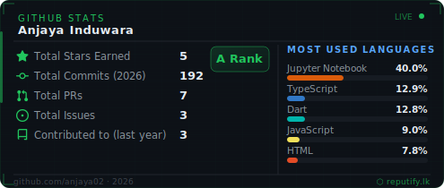

<div align="center">



<br/>

[](https://git.io/typing-svg)


&nbsp;

&nbsp;
<a href="mailto:anjayainduwara@gmail.com"></a>

</div>

<br/>

<table>
<tr>
<td width="50%">

### `> whoami`

```python
class AnjayaInduwara:
    def __init__(self):
        self.role     = "Full-Stack Engineer"
        self.company  = "SLT Mobitel"
        self.startup  = "CEO @ Reputify"
        self.edu      = "CS @ IIT Sri Lanka"
        self.location = "Colombo, Sri Lanka 🇱🇰"
        
    def current_focus(self):
        return [
            "AI-powered SaaS products",
            "Backend engineering at scale",
            "Computational geometry research",
            "Real-time NLP pipelines",
        ]
```

</td>
<td width="50%">

### `> neofetch`

<!-- NEOFETCH START -->
```
  .--.      anjaya02@github
 |o_o |     ────────────────
 |:_/ |     os    ~ dev v2026.4
 //  \ \    up    ~ 24yrs
(|    | )   sh    ~ py/ts/java
/'\_  _/`\  de    ~ vscode
\___)=(___/ wm    ~ win11
            term  ~ wt
 ┌────────┐ role  ~ dev@sltmobitel
 │  grind │ task  ~ reputify.lk
 │  ship  │ cpu   ~ 52d streak
 │  build │ mem   ~ coffee-fueled
 └────────┘ gpu   ~ gpt4o+hf
```
<!-- NEOFETCH END -->

</td>
</tr>
</table>

---

<div align="center">

<br/>

<br/><br/>
</div>

<div align="center">

#### `// languages`


#### `// frameworks & libraries`


#### `// ai & ml`


#### `// infrastructure`


</div>

---

<div align="center">

<br/>

<br/><br/>
</div>

<div align="center">
  
  <br/><br/>
  
</div>

---

<div align="center">

<br/>

<br/><br/>
</div>

<div align="center">
  <picture>
    <source media="(prefers-color-scheme: dark)" srcset="https://raw.githubusercontent.com/anjaya02/anjaya02/output/github-snake-dark.svg" />
    <source media="(prefers-color-scheme: light)" srcset="https://raw.githubusercontent.com/anjaya02/anjaya02/output/github-snake.svg" />
    
  </picture>
</div>

---

<div align="center">

<br/>

<br/><br/>
</div>

<div align="center">

<a href="https://reputify.lk">
  
</a>

<br/><br/>


<sub>8 platforms · 90+ languages · Real-time NLP · Automated responses</sub>

</div>

---

<div align="center">

<br/>

<br/><br/>
</div>

<div align="center">

<a href="https://linkedin.com/in/anjaya02"></a>
<a href="https://github.com/anjaya02"></a>
<a href="https://youtube.com/@anjaya02"></a>
<a href="https://instagram.com/anjaya_induwara"></a>
<a href="https://hackerrank.com/anjayainduwara"></a>
<a href="mailto:anjayainduwara@gmail.com"></a>

</div>

---

<div align="center">
<br/>

> *"The best way to predict the future is to build it."*

<!-- FOOTER START -->
<sub>Colombo, Sri Lanka · <a href="https://github.com/anjaya02">anjaya02</a> · 2026</sub>
<!-- FOOTER END -->
<br/><br/>


</div>
